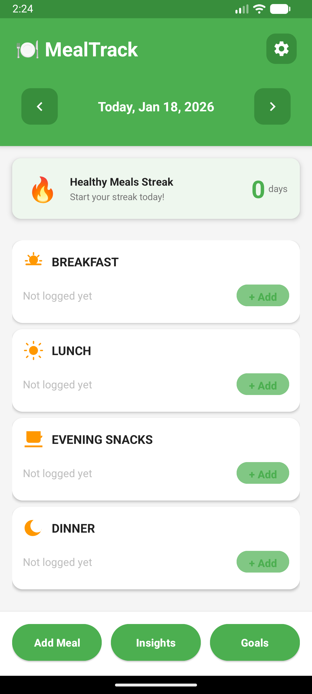
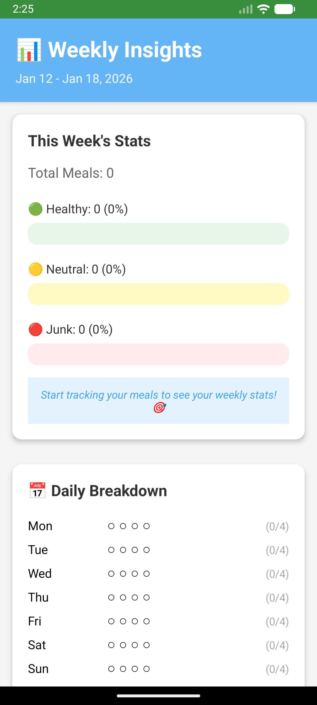
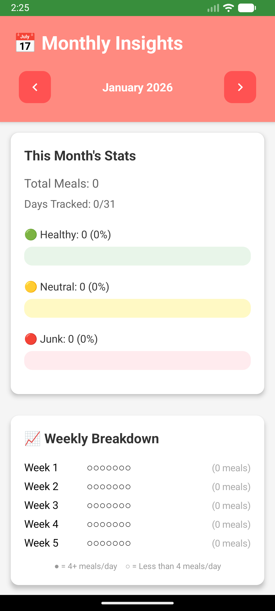

# 🍽️ MealTrack - Android Meal Tracking App

A beautiful, feature-rich Android app for tracking daily meals with health categorization, statistics, and insights.

## ✨ Features

### 📱 Core Features
- **Daily Dashboard** - Track 4 meals per day (Breakfast, Lunch, Evening Snacks, Dinner)
- **Health Categories** - Categorize meals as Healthy 🟢, Neutral ⚪, or Junk 🔴
- **Weekly Summary** - View weekly statistics and trends
- **Monthly Summary** - Analyze monthly eating patterns
- **Goals Tracking** - Set and track healthy eating goals
- **Meal History** - View and edit past meals

### 🎨 UI/UX
- **Material Design 3** - Modern, beautiful interface
- **Dark Mode** - Full dark theme support
- **Smooth Animations** - Polished transitions and interactions
- **Intuitive Navigation** - Easy-to-use interface

### 🔔 Smart Features
- **Meal Reminders** - Customizable notifications for each meal
- **Home Screen Widget** - Quick access and meal summary (3 sizes)
- **Backup & Restore** - Export/import data to JSON
- **Cloud Storage** - Save backups to Google Drive, Dropbox, etc.

### 📊 Analytics
- **Daily Statistics** - Track meals per day
- **Weekly Trends** - See weekly patterns
- **Monthly Insights** - Analyze long-term habits
- **Goal Progress** - Monitor healthy eating goals

## 🚀 Getting Started

### Prerequisites
- Android Studio Arctic Fox or later
- Android SDK 24+ (Android 7.0+)
- Kotlin 1.9.20+

### Installation

1. **Clone the repository**
   ```bash
   git clone https://github.com/yourusername/MealTrack.git
   cd MealTrack
   ```

2. **Open in Android Studio**
   - File → Open → Select the project folder
   - Wait for Gradle sync to complete

3. **Run the app**
   - Connect an Android device or start an emulator
   - Click Run ▶️ or press Shift+F10

### Building APK

**Debug APK:**
```bash
Build → Build Bundle(s) / APK(s) → Build APK(s)
```

**Release APK:**
```bash
Build → Generate Signed Bundle / APK → APK → Next → Fill details → Finish
```

## 📱 Screenshots

<div align="center">

### Main Dashboard


### Meal Logger


### Weekly Insights


### Monthly Insights


### Goals and Achievements


</div>

## 🏗️ Architecture

### Tech Stack
- **Language:** Kotlin
- **Architecture:** MVVM (Model-View-ViewModel)
- **Database:** Room (SQLite)
- **UI:** Material Design 3, XML Layouts
- **Async:** Kotlin Coroutines
- **Notifications:** WorkManager
- **Data Export:** Gson (JSON)

### Project Structure
```
app/src/main/
├── java/com/prajwalpai/mealtracker/
│   ├── data/              # Database, DAO, entities
│   ├── backup/            # Backup/restore logic
│   ├── notifications/     # Notification scheduling
│   ├── widget/            # Home screen widget
│   ├── viewmodel/         # ViewModels
│   └── *.kt               # Activities
├── res/
│   ├── layout/            # XML layouts
│   ├── drawable/          # Icons and graphics
│   ├── values/            # Strings, colors, themes
│   └── xml/               # Widget config, backup rules
└── AndroidManifest.xml
```

## 📚 Documentation

Comprehensive documentation available in the `Documentation/` folder:

- **[index.html](Documentation/index.html)** - Complete interactive guide
- **[BACKUP_RESTORE_GUIDE.md](Documentation/BACKUP_RESTORE_GUIDE.md)** - Backup & restore instructions
- **[WIDGET_IMPLEMENTATION.md](Documentation/WIDGET_IMPLEMENTATION.md)** - Widget technical details
- **[BEGINNER_GUIDE.md](Documentation/BEGINNER_GUIDE.md)** - Android fundamentals
- **[CODE_EXPLANATION.md](Documentation/CODE_EXPLANATION.md)** - Code walkthrough

## 🎯 Key Features Explained

### Backup & Restore
- Export all meal data to JSON format
- Import data from backup files
- Merge or replace existing data
- Cloud storage support (Google Drive, Dropbox)
- Cross-device data transfer

### Home Screen Widget
- 3 resizable sizes (small, medium, large)
- Today's meal summary
- Quick add meal button
- Weekly progress stats (large widget)
- Auto-updates every 30 minutes

### Smart Notifications
- Customizable meal reminders
- 4 daily notifications (one per meal)
- Adjustable times for each meal
- Android 13+ notification permission handling

## 🛠️ Development

### Building from Source

1. **Sync Gradle**
   ```bash
   ./gradlew build
   ```

2. **Run Tests**
   ```bash
   ./gradlew test
   ```

3. **Generate APK**
   ```bash
   ./gradlew assembleDebug
   ```

### Code Style
- Follow Kotlin coding conventions
- Use meaningful variable names
- Comment complex logic
- Keep functions small and focused

## 📄 License

This project is open source and available under the [MIT License](LICENSE).

## 🤝 Contributing

Contributions are welcome! Please feel free to submit a Pull Request.

1. Fork the project
2. Create your feature branch (`git checkout -b feature/AmazingFeature`)
3. Commit your changes (`git commit -m 'Add some AmazingFeature'`)
4. Push to the branch (`git push origin feature/AmazingFeature`)
5. Open a Pull Request

## 📧 Contact

For questions or feedback, please open an issue on GitHub.

## 🙏 Acknowledgments

- Material Design 3 by Google
- Android Jetpack libraries
- Kotlin Coroutines
- Room Database

---

**Built with ❤️ using Kotlin and Material Design 3**
